# PyCity School District Analysis

## Overview of School District Analysis
In this module Maria, the chief data scientist for a city school district, has given us a data set from her school district and tasked us with aggregating the data and showcasing trends in school performance. The dataset contains information about every student (such as their student ID, name, grade, math and reading scores), along with various information on the schools they attend (school name, budget, and charter vs. public). She has given us the six deliverables shown below, along with subtasks for each deliverable which we will walk through further down. The text for each deliverable is taken from [Student_Data_Challenge.ipynb](Student_Data_Challenge.ipynb). Below each subtask is an image of the code necessary to complete it. Output from running the code can be found in the [Student_Data_Challenge.ipynb](Student_Data_Challenge.ipynb) file.

- Deliverable 1: Collect the student data into a DataFrame.
- Deliverable 2: Prepare a cleaned version of the DataFrame.
- Deliverable 3: Summarize key pieces of the data.
- Deliverable 4: Drill down into the data to analyze specific subsets.
- Deliverable 5: Compare and contrast the data through grouping and aggregation functions.
- Deliverable 6: A written analysis of your results.

## Resources
- Data Source: new_full_student_data.csv
- Software: Python 3.7.7, Conda 22.11.0, Jupyter Notebook 5.7.10

##  Deliverable 1: Collect the student data into a DataFrame
To collect the data that you’ll need, complete the following steps:

1. Using the Pandas `read_csv` function and the `os` module, import the data from the `new_full_student_data.csv` file, and create a DataFrame called student_df.

    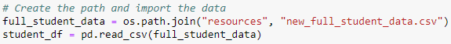

2. Use the head function to confirm that Pandas properly imported the data.

    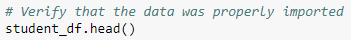

## Deliverable 2: Prepare a cleaned version of the DataFrame
To prepare and clean your data for analysis, complete the following steps:

1. Check for and remove all rows with `NaN`, or missing, values in the student DataFrame.

    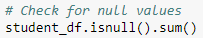

    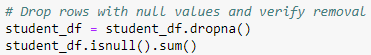

2. Check for and remove all duplicate rows in the student DataFrame.

    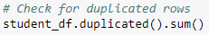

    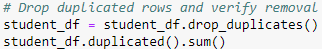

3. Check data types using the `dtypes` property.

   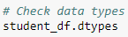

4. Remove the "th" suffix from every value in the grade column using `str` and `replace`.

    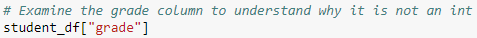

    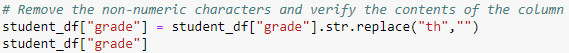

5. Change the grade colum to the `int` type and verify column types.

   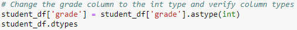

6. Use the head (and/or the tail) function to preview the DataFrame.

   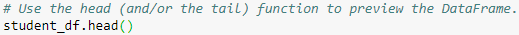

## Deliverable 3: Summarize key pieces of the data
Describe the data using summary statistics on the data as a whole and on individual columns.

1. Generate the summary statistics for each DataFrame by using the `describe` function.

    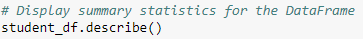

2. Display the mean math score using the `mean` function.

    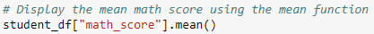

3. Store the minimum reading score as `min_reading_score`.

    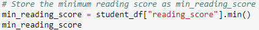

## Deliverable 4: Drill down into the data to analyze specific subsets
Drill down to specific rows, columns, and subsets of the data.

To drill down into the data, complete the following steps:

1. Use `loc` to display the grade column.

    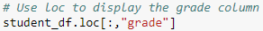

2. Use `iloc` to display the first 3 rows and columns 3, 4, and 5.

    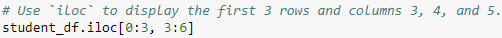

3. Show the rows for grade nine using `loc`.

    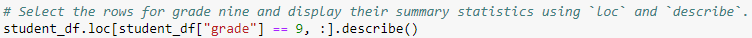

4. Store the row with the minimum overall reading score as `min_reading_row` using `loc` and the `min_reading_score` found in Deliverable 3.

    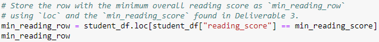

5. Find the reading scores for the school and grade from the output of step three using `loc` with multiple conditional statements.

    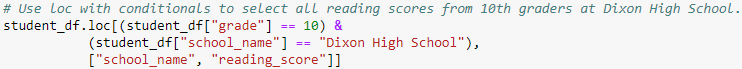

6. Using conditional statements and `loc` or `iloc`, find the mean reading score for all students in grades 11 and 12 combined.

    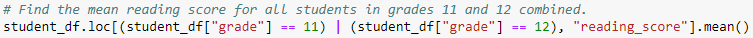

## Deliverable 5: Compare and contrast the data through grouping and aggregation functions
Compare district vs charter schools for budget, size, and scores.

Make comparisons within your data by completing the following steps:

1. Using the `groupby` and `mean` functions, find the average budget for each school type.

    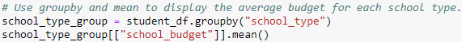

2. Using the `groupby`, `count`, and `sort_values` functions, find the total number of students at each school and sort them from largest to smallest.

    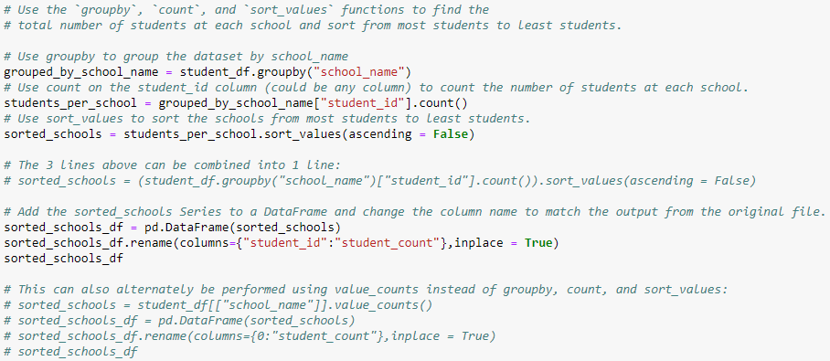

3. Using the `groupby` and `mean` functions, look at the average math score by grade for each school type.

    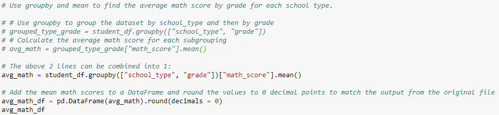

## Deliverable 6: A written analysis of your results
Based on the three outputs from Deliverable 5, some [relatively useless] conclusions can be drawn: 
- The average budget for charter schools ($872,626) is lower than that of public schools ($911,196).
- Montgomery High School has the most students (2,038) while Chang High School has the fewest (171).
- Charter schools have a higher average math score for grades 9 through 11, but public schools have a higher math score for grade 12.

None of these findings is very meaningful on its own. To obtain more significant conclusions for Maria, we need to dive even deeper into the data. For instance, the average school budget for charter vs. public schools does not tell us much because the schools vary widely in size. Some schools may have much more money than others due to the number of students it has.

We could take the table in the second part of Deliverable 5 (students per school) and add more information such as the average budget per student (school's total budget divided by total number of students) and the average math and reading scores. This data would allow us to compare students' scores based on the average money spent PER student, not simply the average total amount of money each charter or public school has. **If a correlation is found showing that schools with less money to spend per student have lower math and reading scores, Maria can recommend to the school district that they allocate more money to those schools.**

Additionally, the average math and reading scores can be compared to school size; it may be found that larger schools have lower scores because there are more students packed into each class. An additional set of data could be gathered: the number of teachers per school. This metric is another way to divide and compare students' scores and **could potentially help the school district decide where to hire more teachers.**

The average reading and math scores for each school can also be broken apart by grade. **This more granular data will allow the school district to pinpoint lower scores in a certain grade or subject to determine if a certain teacher or group of teachers is not adequately performing their job.** Similarly, the overall curricula can be evaluated between charter vs. public schools by comparing the average reading and math scores against budget per student for each type of school. Pick two relatively similar values for budget per student and compare their reading and math scores. **If there is still a discrepancy, the school system may need to re-evaluate the curriculum for that particular school type and recommend changes to bring those students' scores up to par.**